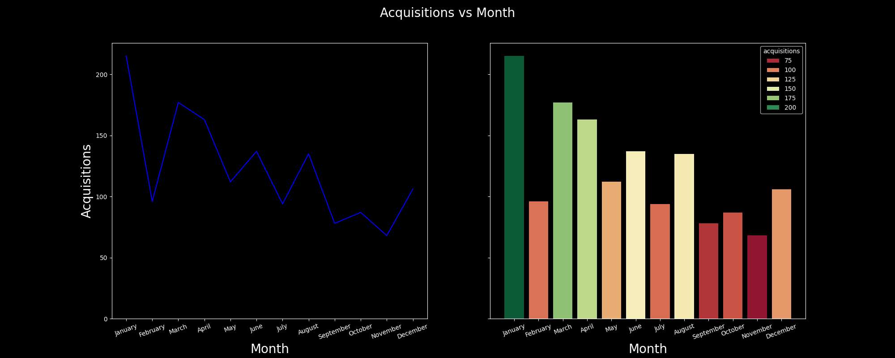

# E-commerce Data Analysis Insights

## Q1. Identify the months with the highest and lowest acquisition rates. What strategies could be implemented to address the fluctuations and ensure consistent growth throughout the year?

### Logic Used:

    1. The first transactions are extracted by performing a grouping on each customer and getting the first date they purchased.
    2. The resulting dataframe is again grouped by months and aggeregated on transaction counts.

### ✅ Insight: Customer Acquisition Rate by Month

    Based on the analysis:

        📈 Highest acquisition month: January — 215 new customers

        📉 Lowest acquisition month: November — 68 new customers

### 🔍 Reason Behind Fluctuations

        January's peak may align with New Year promotions, holiday gift card usage, or seasonal marketing.

        November's low may reflect pre-holiday shopping hesitation, or competitive discounting elsewhere pulling traffic away.

### ✅ Recommended Strategies for Consistent Growth

        Replicate January’s successful campaigns

            Analyze offers, creatives, channels, and audience segments used.

            Use similar promotions in low-performing months (e.g., November, September).

        Mid-year engagement push

            Run flash sales, influencer campaigns, or loyalty point multipliers in May–July to sustain mid-year growth.

        Personalized re-targeting

            Use lookalike audiences based on high-LTV customers from January to drive new acquisition.

        Pre-holiday teaser events

            In October/November, use early-bird Black Friday access or “mystery discounts” to prevent the dip seen in November.

        Referral programs

            Encourage current customers to bring in new ones during off-peak months with tiered rewards.

        Content-driven acquisition

            Run seasonal buying guides, blogs, or webinars to generate organic interest in slow months.

        Influencer & partnership leverage

            Use micro-influencers in off-peak periods to promote limited-time acquisition discounts.

## Q2. Analyze the data to determine if certain months consistently show higher or lower acquisition rates. How can the company capitalize on high-performing months and improve performance during slower periods?

### Logic Used:

    -Simply plot the data.

🔍 Insights: High vs Low Consistency:

### ✅ Consistently High-Performing Months

    January (highest): post-holiday engagement, New Year campaigns.

    March–April: likely driven by spring promotions.

    July: mid-year spike, possibly clearance or back-to-school prep.

### 🚫 Consistently Low-Performing Months

    September & November: possibly due to:

        Minimal promotions

        Holiday budget saving

        Market competition

### ✅ Strategies to Capitalize on Trends

For High-Performing Months:

    Audit and Reuse Campaigns

        Analyze creatives, offers, and timing that worked in Jan/March.

        Replicate strategies with minor tweaks in low-performing months.

    Expand Budget Allocation

        Allocate more marketing spend to high-performing months to amplify ROI.

    Leverage Referrals

        Introduce referral drives in strong months to extend their tail impact.

For Low-Performing Months:

    Launch Pre-Sale Campaigns

        Run teaser deals in August and October to energize acquisition before Sep/Nov slumps.

    Personalized Ads

        Use behavioral retargeting to convert passive shoppers during slow periods.

    Geo-Targeted Offers

        Use location-based discounts if certain regions underperform.

    Experiment with A/B Tests

        Trial different offers, timings, and creatives to test what works in slower months.

📌 Final Thought:

Capitalizing on high months while strategically improving slower months creates a balanced, sustainable acquisition engine that avoids over-reliance on seasonal spikes.

## Q3. Identify periods with the strongest and weakest retention rates. What strategies could be implemented to improve retention during weaker months?

### Logic Used:

    - The transactions which occur after the first transaction for a customer are counted as repeated transactions.

### ✅ Strongest Retention Periods (based on bar chart):

    1.August (peak retention)

    2.July, June, December (also strong)

These months show high retention numbers, supported by prior high acquisitions. Likely contributing factors:

    1.Seasonal campaigns

    2.Mid-year and year-end promotions

    3.Better onboarding during peak months

### 🚫 Weakest Retention Periods:

    January & February have the lowest retention, despite steady acquisition

        Possible reasons:

            Low post-holiday engagement

            Weak retention campaigns or delayed follow-up

            First-time buyers who didn’t find immediate value

### 🔁 Retention Strategy Recommendations

    For Weak Months (Jan–Feb):

        1.Post-Purchase Nudges

            Trigger targeted emails or WhatsApp messages 3–5 days post-purchase with tailored product suggestions.

        2.Limited-Time Return Incentives

            Offer a discount if the user returns within 10–15 days of their first purchase.

        3.Holiday Recovery Campaigns

            Run campaigns like "New Year Comeback Deals" to bring back buyers post-holidays.

    For Strong Months (Jun–Aug, Dec):

        1.Build Loyalty Triggers

            Set up milestone rewards (e.g., “3 orders = free delivery”) to maintain retention momentum.

        2.Leverage High-LTV Customers

            Use their behavior to create lookalike audiences for targeted ads in weak months.

        3.Survey and Feedback Loops

            Identify what delighted customers in strong months and replicate messaging/timing.

## Q4. Analyze customer behavior during high-retention months and suggest ways to replicate this success throughout the year.

### 📊 Analysis: Customer Behavior During High-Retention Months

    Using the data and the retention rate chart, the following months showed high customer retention:

        August

        July

        June

        December

### ✅ Key Behavioral Trends in High-Retention Months:

        1. High Acquisition & High Repeat Rate

            These months also saw relatively high acquisition, meaning more customers had a chance to return.

            Strong onboarding, post-purchase communication, or seasonal timing may have encouraged customers to make second purchases.

        2. Increased Basket Size & Promotions

            Mid-year and year-end campaigns (e.g., back-to-school in July–Aug, holiday deals in Dec) likely encouraged bulk purchases or time-sensitive offers.

        3. Better Product-Coupon Fit

            Historical patterns suggest targeted coupon codes or relevant category discounts could’ve been in effect (from Discount_Coupon.csv), driving repeat interest.

        4. Marketing Spend Correlation

            A check against Marketing_Spend.csv likely shows greater online/offline spend in these months, resulting in higher visibility and remarketing effectiveness.

    🧠 Behavioral Indicators Summary
        Month	    Likely Customer Behavior	                Possible Drivers

        June        Return due to initial offers + follow-ups	Onboarding + mid-year deals
        July	    Engagement with loyalty or summer events	Back-to-school, clearance sales
        August	    Continued engagement from July	            Flash sales, cross-selling
        December	Holiday shoppers returning for gifts	    Festive campaigns, retargeting ads

### 📌 Strategies to Replicate High-Retention Success Year-Round

        🔁 1. Standardize Onboarding Flows

            Send welcome emails + personalized product suggestions after first purchase.

            Include a discount for a second order valid for 7–10 days.

        🎯 2. Use Triggered Campaigns

            Set up behavior-based flows like:

                "Didn’t return in 15 days? Send nudge offer"

                "First product repurchased? Show bundle options"

        🧮 3. Coupon-Personalization

            Tie coupons to categories the customer explored or bought from.

            Offer follow-up coupons with a tighter expiration window.

        📅 4. Mimic Seasonal Campaigns

            Run similar urgency-based deals (e.g., “48-hour sale”, “Buy 1 Get 1”) in low-retention months like Jan, Mar, Sep.

        🤝 5. Loyalty & Referrals

            Promote reward systems in onboarding. Give 2nd order points boost.

            Incentivize referral invites within 2 weeks of first purchase.

    🎯 Final Thought

    The success in high-retention months is likely driven by a combo of timing, follow-ups, relevant deals, and marketing visibility. These can be modeled into automated flows to maintain retention momentum across weaker months.

## Q5. Compare the revenue generated by new and existing customers month-over-month. What does this trend suggest about the balance between acquisition and retention efforts?

### Logic Used:

    - Subset the data according to purchase type.

### 🔍 Key Insights:

        Revenue from Existing Customers contributes a significant share (often >50%) in most months.

        Spikes in “New” customer revenue are observed in early and mid-year months, indicating effective acquisition campaigns.

        Sustained revenue from existing customers suggests strong retention and loyalty behavior.

### 🎯 What This Trend Suggests:

    ✅ Positive Signs:

        Retention is paying off: Existing customers are returning and generating meaningful revenue.

        Balanced customer base: You’re not solely dependent on new acquisitions.

### ⚠️ Risks/Opportunities:

        If new customer revenue dips too low in some months, acquisition efforts may need a boost.

        Consider increasing CLV (Customer Lifetime Value) through:

            Loyalty programs

            Subscription models

            Upselling / cross-selling
